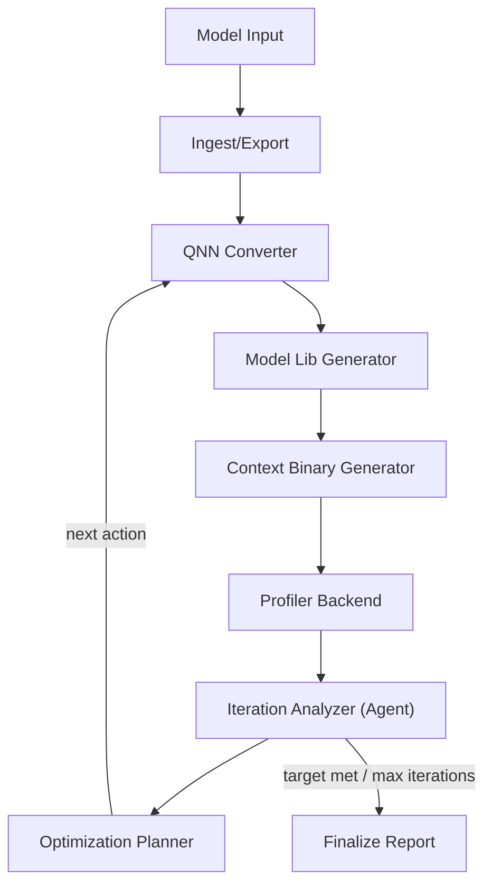

# Architecture

## Design Goals

- Local-first conversion: ONNX/PyTorch conversion and QNN artifact generation happen on your PC.
- Device-targeted binaries: context binary generation uses target-specific SoC/backend settings.
- Closed-loop optimization: profiling results feed back into optimization decisions.
- Modular extension: new SoCs, new profilers, and new optimization agents can be added without rewriting pipeline core.

## Component Map

## Core Modules

- `config.py`
  - YAML -> typed runtime config
  - env var expansion for portable configs
- `targets/registry.py`
  - canonical SoC presets
  - target config hydration for missing fields
- `ingest/model_loader.py`
  - ONNX passthrough or PyTorch export via configurable command template
- `conversion/qnn_backend.py`
  - command builder for:
    - `qnn-onnx-converter`
    - `qnn-model-lib-generator`
    - `qnn-context-binary-generator`
- `profiling/aihub_client.py`
  - profiling backend protocol
  - `MockProfilerBackend` for offline validation
  - `QAIHubProfilerBackend` scaffold for cloud profiling
- `optimization/strategy.py`
  - deterministic baseline strategy
  - action application and optional architecture hook execution
- `optimization/iteration_analyzer.py`
  - per-iteration bottleneck analysis (rule-based or optional LLM)
- `workflow/graph.py`
  - LangGraph state machine and loop control
- `reports/writer.py`
  - per-iteration JSON metrics
  - final markdown run summary

## State Model (LangGraph)

Pipeline state fields include:
- `iteration`
- `onnx_model`
- `conversion_artifacts`
- `latest_profile`
- `history`
- `action_history`
- `continue_loop`
- `stop_reason`

Nodes mutate only relevant fields, which keeps transitions explicit and testable.

## Control Flow

1. Initialize run directory and metadata.
2. Prepare ONNX model.
3. Select optimization action.
4. Apply action (quantization knobs, resize, optional architecture command).
5. Convert to QNN artifacts and context binary.
6. Profile on selected backend.
7. Evaluate target attainment and routing decision.
8. Loop or finalize.

## Extension Strategy

### Add a new hardware family

1. Register profile in `targets/registry.py`.
2. Add/override backend extension config JSON.
3. Update YAML target section.

### Add a new profiler backend

1. Implement `ProfilerBackend` protocol.
2. Add constructor branch in `build_profiler`.

### Add AI agents

1. Insert agent node between `profile_model` and `evaluate`, or replace `select_action`.
2. Feed agent with `history`, action metadata, and conversion/profile logs.
3. Return structured updates to state (`current_action`, risk flags, constraints).

## Reliability Controls

- Iteration cap (`max_iterations`)
- deterministic run directories
- action and metrics persisted per iteration
- final summary includes stop reason and best metric

## Branching/Collaboration Model

Use a branch-per-feature approach (`codex/<feature>`) for each major capability:
- conversion backend changes
- profiler integration changes
- optimization policy changes
- agent additions

This keeps experiment lines isolated for runtime tuning campaigns.
